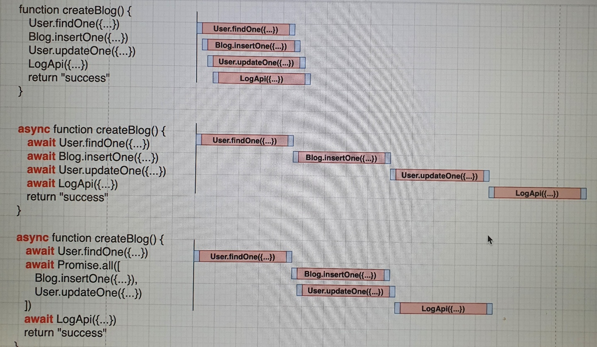

# inflearn-mongodb-course-63723 목차

Lecture : [몽고디비-기초-실무](https://www.inflearn.com/course/c/dashboard)

## Lectrue Part 1. Mongodb Intro

[MongodbIntro](https://github.com/lucy74310/inflearn-mongodb-course-63723/tree/main/MongodbIntro.md)

## Lectrue Part 2~3 Async Programming

[Async Programming](https://github.com/lucy74310/inflearn-mongodb-course-63723/tree/main/AsyncProgramming.md)

## Lectrue Part 4 Node.js 로 Mongodb 다루기

[Node.js 로 Mongodb 다루기](https://github.com/lucy74310/inflearn-mongodb-course-63723/tree/main/RestfulAPIIntro.md)

## Lectrue Part 5~6. 관계된 데이터 효율적으로 읽기 & 문서내장으로 퍼포먼스 극대화

[관계된 데이터 효율적으로 읽기 & 문서내장으로 퍼포먼스 극대화](https://github.com/lucy74310/inflearn-mongodb-course-63723/tree/main/RelatedDataManagingInMongoDB.md)

<hr>

## npm이란?

자바스크립트 생태계
ㄴ 반복적인 것들은 웬만하면 기존 개발자들이 만들어준 모듈들 사용
그 모듈들 다운받을수 있는게 npm이다.

## express

REST API를 만들기 쉽게 개발자들이 구현해놓은 프레임웤(라이브러리) 중 하나

```
npm init
npm i express
npm i -D nodemon // 수정될때마다 알아서 노드 리로드하여 반영해줌. 개발시에만 사용이므로 -D
```

```
Create  -> Post
Read    -> Get
Update  -> Put
Delete  -> Delete
```

post쓰기 위해서 json파싱을 해줘야 req.body 제대로 받을수 있다. -> middleware 필요
쉽게 생각하면 함수고 끝나면 그다음 함수를 실행하고 실행해서..
http request ---> cors -> JSON.parse -> authenticate -> logging -> router1 -> router2 --->

```
app.use(express.json()) // JSON.parse 미들웨어
```

## 비동기 프로그래밍

### callback



Promise.all을 잘 사용하는것도 중요

node는 CPU intensive 한것을 안하는게 조음.
아니면 child thread 를 만들어서... 처리 또는
CPU intensive한걸 잘 처리하는 언어로 만든 api를 호출 등
