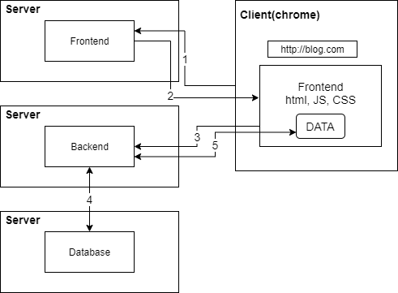
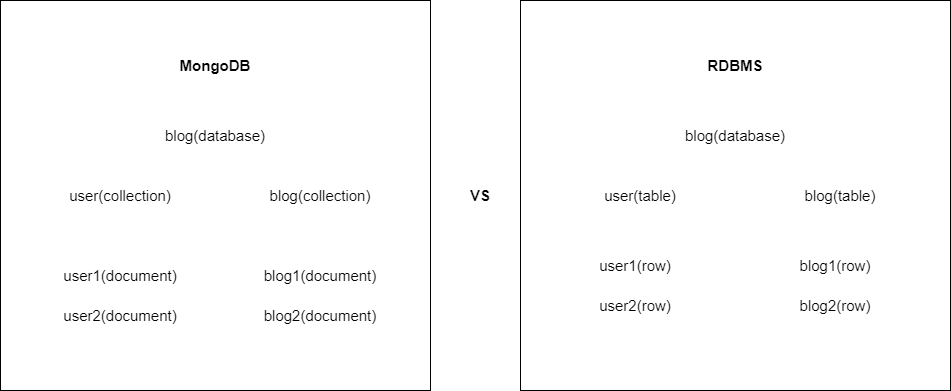

# inflearn-mongodb-course-63723 목차

Lecture : [몽고디비-기초-실무](https://www.inflearn.com/course/c/dashboard)

## Lectrue Part 1. Mongodb Intro

[MongodbIntro](https://github.com/lucy74310/inflearn-mongodb-course-63723/tree/main/MongodbIntro.md)

## Lectrue Part 2~3 Async Programming

[Async Programming](https://github.com/lucy74310/inflearn-mongodb-course-63723/tree/main/AsyncProgramming.md)

## Lectrue Part 4 Node.js 로 Mongodb 다루기

[Node.js 로 Mongodb 다루기](https://github.com/lucy74310/inflearn-mongodb-course-63723/tree/main/RestfulAPIIntro.md)

## Lectrue Part 5~6. 관계된 데이터 효율적으로 읽기 & 문서내장으로 퍼포먼스 극대화

[관계된 데이터 효율적으로 읽기 & 문서내장으로 퍼포먼스 극대화](https://github.com/lucy74310/inflearn-mongodb-course-63723/tree/main/RelatedDataManagingInMongoDB.md)

<hr>

# Lecture Intro

### 몽고DB를 몽고DB 스럽게 쓰자.

관계형DB처럼 쓰지말고

### 웹개발 생태계


This is No.4 focus lecture

# MongoDB Intro

## MongoDB Atlas 생성 및 Compass 설치

## Mongodb Compass 에서 \_MongoSH Beta 에서 DB 조작하기

### Create & find

```
db
test
use blog
'switched to db blog' // blog 라는 database 로 이동
db.users.insertOne({ name:"Bugwang Jo", email:"lucy74310@gmail.com"}) // 유저생성
{ acknowledged: true,
  insertedId: ObjectId("616b06d0a43855fac8a0c1ec") }

db.users.find() // 읽어오기 -> 이때 blog란 db 생성, Bugwang Jo 데이터 도큐먼트 생성
{ _id: ObjectId("616b06d0a43855fac8a0c1ec"),
  name: 'Bugwang Jo',
  email: 'lucy74310@gmail.com' }
```

\_id :: 몽고db에서 자동부여해주는 unique key (관계형 db의 primary key)

```
db.users.insertOne({ name: {first:"Elon", last:"Musk"} })
{ acknowledged: true,
  insertedId: ObjectId("616b07b1a43855fac8a0c1ed") }
db.users.find()
{ _id: ObjectId("616b06d0a43855fac8a0c1ec"),
  name: 'Bugwang Jo',
  email: 'lucy74310@gmail.com' }
{ _id: ObjectId("616b07b1a43855fac8a0c1ed"),
  name: { first: 'Elon', last: 'Musk' } }
```

관계형 db는 표에 저장한다면, 몽고디비는 json형태로 저장 (bson)

```
_id
:
616b07b1a43855fac8a0c1ed
name
:
first
:
"Elon"
last
:
"Musk"

```

단순히 객체를 내장하거나, 객체안에 객체를 넣거나, 배열을 넣을수도 있다
--> Schemaless 전혀 다른 형식이 들어가도 상관이 없다

(관계형 db는 string은 string만 int는 int만. -> 엄격함)

### Update

```
db.users.updateOne({name: "Bugwang Jo"}, {$set: { age:29 }}) // 첫번째파람 : 업데이트할 데이터 키 , 두번째파람 : 업데이트할 내용 (새로운 데이터 set함)
{ acknowledged: true,
  insertedId: null,
  matchedCount: 1,
  modifiedCount: 1,
  upsertedCount: 0 }

db.users.findOne({ name: "Bugwang Jo"})
{ _id: ObjectId("616b06d0a43855fac8a0c1ec"),
  name: 'Bugwang Jo',
  email: 'lucy74310@gmail.com',
  age: 29 }
```

### Update Nested Document

```
db.users.findOne({ "name.first": "Elon"}) // 따옴표 쓰고 안에 .으로 해서 deep 한 객체 찾음
{ _id: ObjectId("616b07b1a43855fac8a0c1ed"),
  name: { first: 'Elon', last: 'Musk' } }

db.users.updateOne({ "name.first": "Elon" }, { $set: { "name.last": "musk2" } })
{ acknowledged: true,
  insertedId: null,
  matchedCount: 1,
  modifiedCount: 1,
  upsertedCount: 0 }
```

### Update with ObjectID

\_id로 찾을땐 어떻게?

```
db.users.findOne({ _id: "616b06d0a43855fac8a0c1ec"}) // 이럼 안됨. Object ID 라서
```

```
db.users.findOne({ _id: ObjectId("616b06d0a43855fac8a0c1ec")})
{ _id: ObjectId("616b06d0a43855fac8a0c1ec"),
  name: 'Bugwang Jo',
  email: 'lucy74310@gmail.com',
  age: 29 }
```

나이 1살 추가

```
db.users.updateOne({ _id: ObjectId("616b06d0a43855fac8a0c1ec")}, { $inc:{ age:1}})
{ acknowledged: true,
  insertedId: null,
  matchedCount: 1,
  modifiedCount: 1,
  upsertedCount: 0 }
db.users.findOne({_id: ObjectId("616b06d0a43855fac8a0c1ec")})
{ _id: ObjectId("616b06d0a43855fac8a0c1ec"),
  name: 'Bugwang Jo',
  email: 'lucy74310@gmail.com',
  age: 30 }
```

### Delete Document

```
db.users.findOne({_id: ObjectId("616b06d0a43855fac8a0c1ec")})
{ _id: ObjectId("616b06d0a43855fac8a0c1ec"),
  name: 'Bugwang Jo',
  email: 'lucy74310@gmail.com',
  age: 30 }
db.users.deleteOne({_id: ObjectId("616b06d0a43855fac8a0c1ec")})
{ acknowledged: true, deletedCount: 1 }
db.users.find()
{ _id: ObjectId("616b07b1a43855fac8a0c1ed"),
  name: { first: 'Elon', last: 'musk2' } }
```

### DB구조


